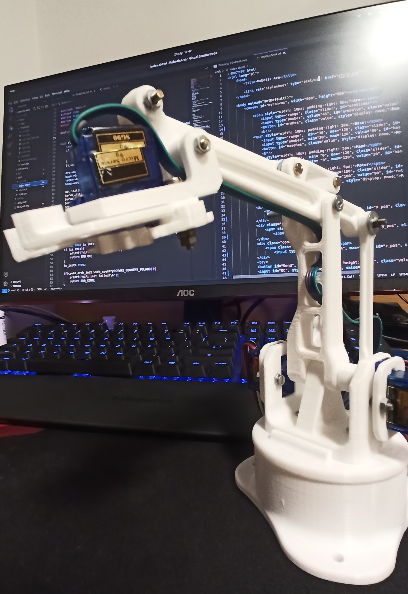
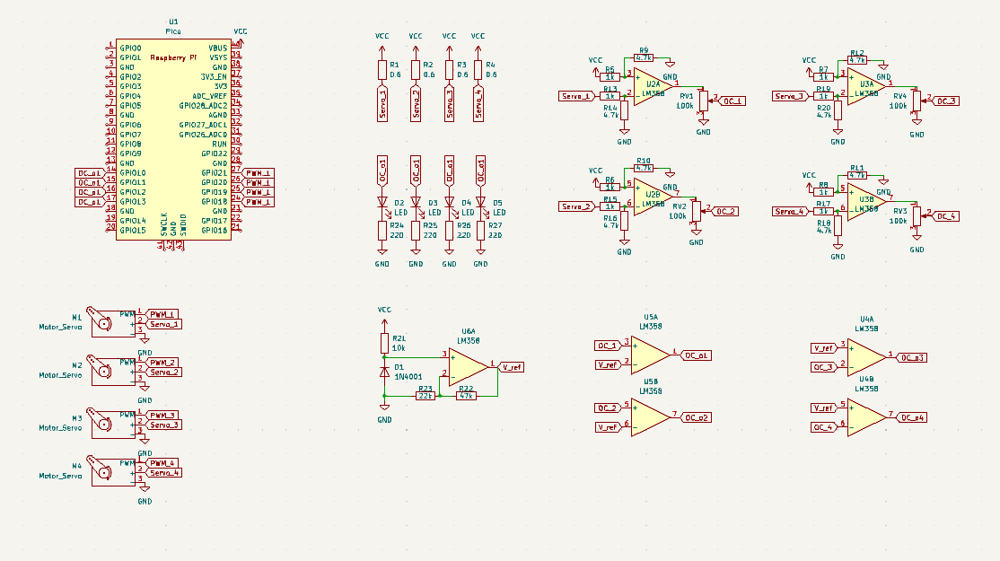

# Robotic Arm
Poniższy projekt przedstawia roboramie, wykonane w ramach projektu zaliczeniowego na przedmiot `Systemy mikroprocesorowe II`.

## Wstęp
Tematem projektu jest robotyczne ramie, z możliwością sterowania po HTTP,
Ramie, zostało wydrukowane z projektu: *<p>https://www.thingiverse.com/thing:1015238</p>*



Sterowaniem zajmuje się mikroprocesor RP2040 z modułem Wi-Fi cyw43.
A projekt rozłożony jest między dwa języki *C* i *JavaScript*.
* W języku *C*, zbudowana została aplikacja na µP, która zawiera niskopoziomowe algorytmy sterowania silnikami, wykrywania przeciążeń serw oraz poprzez moduł Wi-Fi łączy się z siecią domową i wystawia stronę HTTP, będącą HID.
* Język *JS*, odpowiada, za rysowanie aktualnej pozycji ramienia, wyznaczenie położenia w osiach XYZ oraz odczytanie i wysłanie wartości kątów, jakie mają być ustawione w ramieniu.


## Build
!!! ***Wszystkie operację należy wykonywać w pliku `Src`*** !!!

Aby zbudować projekt należy:

1. Stworzyć pliki strony internetowej
```bash
$ python makefsdata.py
```
2. W pliku `main.c`, należy nadać NAZWĘ i HASŁO do sieci, z którą chcemy aby połączyła się malinka
```c
18 #include "PASS.h"
19 #ifndef SSID
20 #define SSID mySSID // Enter yours SSID
21 #define PASS myPASS // Enter yours PASSWORD
22 #endif
```
Alternatywnie w dowolnym folderze `Src`, można stworzyć plik `PASS.h`, w którym należy zadeklarować SSID oraz PASS
```c
#define SSID mySSID // Enter yours SSID
#define PASS myPASS // Enter yours PASSWORD
```
3. Zbudować projekt
```bash
$ mkdir -p build && cd $_
$ cmake ..
$ make
```
4. Wgrać projekt do płytki raspberry PI Pico W
```bash
$ cp build/main.uf2 /media/$USER/RPI-RP2
```

### Poprawne uruchomienie
Po poprawnej implementacji, Raspberry Pi PICO W powinno zapalić wbudowaną diodę, a na pinie `GPIO26` zostanie wygenerowany przebieg prostokątny o czestotliwosci ≈ 50Hz i  wypełnieniu 50%.

**Odczyt IP**:
Po połączeniu na terminalu podłączonym przez serial, zostanie przesłany adres IP.

Alternatywnie adres IP, można także sprawdzić w liście urządzeń na routerze.

### Błedy
Wszelkie błedy, które mogą wystąpić podczas uruchomienia, będą wyświetlane przez serial, a błędy krytyczne mogą zatrzymać cały proces.

| Nr | Komunikat | Oznaczenie błędu | Wyjaśnienie | Czy zatrzyma procesor |
|:---|:---------:|:----------------:|:-----------:|:---------------------:|
| 1. |WiFi module is init | ERR_OK  |Ponowna próba inicjalizacji WiFi| Nie |
| 2. |WiFi init failed    | ERR_CONN|Bład komunikacji między RP2040 a CYW43| TAK
| 3. |Cannot connected to `SSID` |ERR_CONN| Błąd podczas proby nawiązania połączenia z siecią WiFi | TAK|
| 4. |Open http server | ERR_OK | Zakończono proces łączenia z WiFi, a serwer HTTP został postawiony na przydzielonym adresie IP | Nie|
| 5. | Servo are init | ERR_OK | Ponowna próba inicjalizacji serw | Nie |
| 6. | Over current protection is turn on | ERR_OK | Ponowna próba włączenia ochrony przeciw przetężeniowej | Nie |


## Schemat


W schemacie układu można wyróżnić 4 główne bloki
- Raspberry Pi PICO W,
- zestaw 4 serwo mechanizmów,
- źródło napięcia referencyjnego,
- układ wykrywania przekroczenia prądu
    - 4 rezystory do pomiaru prądu,
    - 4 wzmacniacze operacyjne, mierzące spadek napięcia na rezystancji pomiarowej,
    - 4 komparatory, które porównują napięcie z wzmacniaczy z napięciem referencyjnym.

### Działanie
Użytkownik przez przeglądarkę łączy się z serwerem WWW stawianym przez malinkę.
Pozwala to na sterowanie każdym z silników, poprzez zadanie dozwolonego kąta.
W momencie, gdy któreś serwo nie może wykonać zadanego ruchu - zaczyna pobierać większy prąd, uruchamiany jest kilku sekundowy alarm.
Jeśli po zakończeniu alarmu serwo nadal pobiera duży prąd, silnik zostaje wyłączony* - a układ czeka na ponowne uruchomienie przez użytkownika.
Informacja o przeciążeniu zostaje oczywiście wysłane do użytkownika, poprzez stronę WWW.

*chwytak, nie zostaje wyłączony a jego zgięcie ograniczone jest do kąta, którego osiągnięcie jeszcze nie przekraczało wartości progowej.
